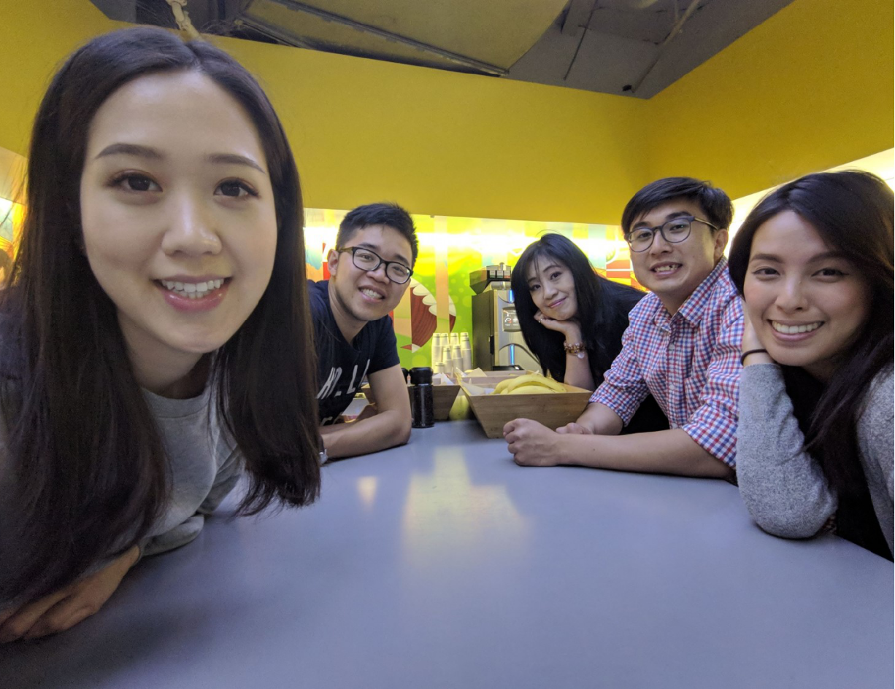
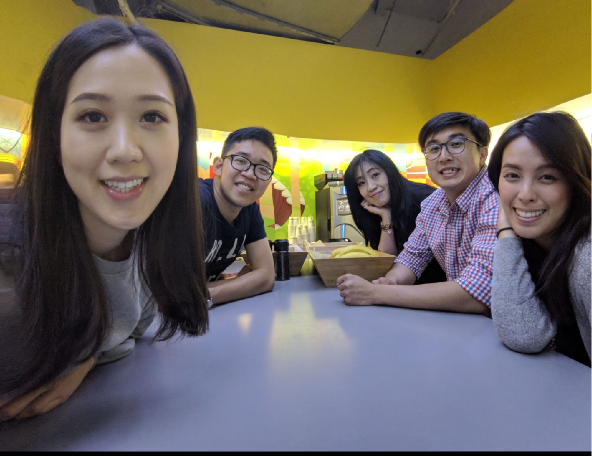
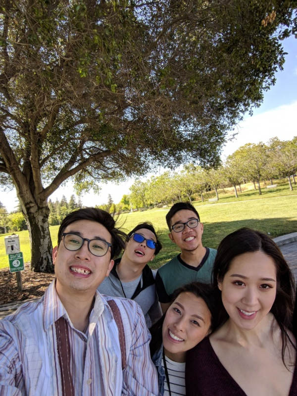

# Distortion-Free-Wide-Angle-Portraits
The C++ realization of the paper Distortion-Free Wide-Angle Portraits on Camera Phones by Shih et al., which can correct perspective aberrations in wide-angle portraits. 

## Introduction
The wide field of view (FOV) of a wide-angle camera introduces more severe perspective distortion, especially causing faces to be stretched, squeezed, and tilted to look very different from reality. Correcting this distortion requires professional and tedious image editing skills. However, the algorithm proposed in the paper can make faces undistorted without affecting other parts of the photo. Given a portrait as input, an optimization problem is formulated to create a content-aware deformable mesh that locally adapts to the stereoscopic projection of the face region and evolves seamlessly to the perspective projection on the background.

For more informations concerning the algorithm, see Ref[1].

## Inplementation
I noticed that there has been a inplementation using Python & Pytorch (Ref[2]). However, the way of inplementation is actually different from the paper.

Here, a C++ inplementation is provided, which follows the method in the original paper as much as possible.

**Instead of using a DL model to identify the region of faces, a simple interaction based on OpenCV is provided to help the user to specify the regions of faces. **

## Environment
Dependencies:
* Eigen
* OpenCV
* Ceres
* Glog
* SuiteSparse (Needed for solving large sparse linear systems)
Remark: The installation of ceres in windows is a little troublesome. For me, Vcpkg (Ref[3]) is useful to help to install and manage my packages. 

## Usage
### Structure of files:

- main.cpp  *Source code (the only code)*

- examples  *Examples of this inplementation*
  - origin1.png
  - result1.png
  - origin2.png
  - result2.png
  - origin3.png
  - result3p.png
  - result3m.png
  
### Running instructions:

Follow the prompts and input the necessary information, and then obtain intermediate and final run results in the results directory.

#### Some parameter explanations:

The FOV of the image: The field of view of the image. It needs to be given according to the shooting equipment. Typical values are 80° - 120°;

The scale value: The number of pixels per unit length of the grid, set according to the number of image pixels. Typical values: 8 - 64;

Mask generation options: The mask for the face area. It can be obtained by running the Pycharm project, and then specify the mask path to pass in; or select the interactive setting.

#### Interaction Description:

Mouse interaction marks the face area. Press the left button to start drawing. Keep the left button pressed to draw a closed curve and release the left button. Right-click in the area to color the area blue, indicating that an area is marked successfully.

Similarly, multiple zone markers are supported.

When the marking is completed, press the Enter key to confirm that the marking is completed and the mask is automatically generated.

Note: If the curve is not closed, the entire image area is colored (ie all pixels are marked). This is an incorrect operation.

The naming description of the running result:

* imInit.png: image generated under initial solution
* imOptima.png: optimized result
* imP.png: The result of perspective mapping, which is the original image
* imU.png: result of stereographic projection
* imUMask.png: Stereographic projection instead of the face area in perspective projection, the generated image
* mask.png: face mask image
* matxOptima.txt: the x-coordinate of the grid after optimization, see the source file function for the reading method
* matyOptima.txt: The y-coordinate of the optimized grid, see the source file function for the reading method
* meshInit.png: mesh for initial solution
* meshOptima.png: optimized mesh
* meshP.png: mesh for perspective projection
* meshU.png: Mesh for stereographic projection

## Result
The effeciency is dependent on the size of the image and the density of the grid. In the test on the PC with CPU `Intel(R) Core(TM) i7-8565U CPU @ 1.80GHz`, almost 1 second is used to deal with one image.  

Some test results:

1. Origin image Vs Result image:

2. Origin image Vs Result image:

3. Origin image Vs Result images of the paper and mine:

*Origin*

*Paper*

*Mine*

## References
[1] YiChang Shih, Wei-Sheng Lai, and Chia-Kai Liang. Distortion-free wide-angle portraits on camera phones. ACM Trans. Graph., 38(4), July 2019.
[2] https://github.com/yzhq97/distortion-free-wide-angle.pytorch
[3] https://github.com/microsoft/vcpkg
